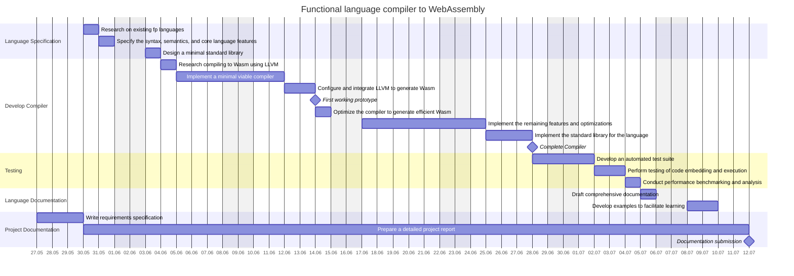

# Conversion

```sh
mmdc -i diagrams.md -o out/diagram.png -s 3
```

# Diagrams

## Planning

<!--
= Tasks

+ *Define Language Specification*
  + Conduct research on existing functional programming languages and their features.
  + Specify the syntax, semantics, and core language features, including pattern matching, first-class functions, immutable data structures, type system, and module system.
  + Design the requirements and structure for a minimal standard library.
+ *Develop Compiler*
  + Research the requirements and best practices for compiling to Wasm using LLVM and what language to use for the front-end.
  + Implement a minimal viable compiler (lexer, parser and LLVM-IR code generation) for the new functional language with limited features.
  + Configure and integrate LLVM to generate Wasm bytecode (and native code) from the LLVM-IR output.
  + Optimize the compiler to generate efficient Wasm code and explore LLVM optimizations for the generated code.
  + Implement the remaining language features and optimizations to complete the compiler.
  + Implement a simple standard library for the language.
+ *Testing and Validation*
  + Develop an automated test suite to validate the correctness of the compiler and the Wasm bytecode.
  + Perform testing of code embedding and execution in different environments and platforms.
  + Conduct performance benchmarking and analysis to evaluate the efficiency of the compiled code.
+ *Create Language Documentation*
  + Draft comprehensive documentation covering the language syntax, semantics, features, and a reference for the standard library.
  + Develop examples to facilitate learning and adoption of the language and its embedded use cases.
+ *Project Documentation*
  + Prepare a detailed project report documenting the design, implementation, and evaluation of the language and compiler.
  + Include insights, challenges faced, and recommendations for potential future improvements or extensions.
-->


